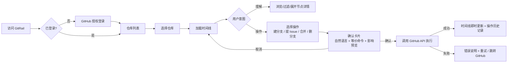

# 需求分析

| 项 | 内容 |
| --- | --- |
| 文档版本 | v0.1 |
| 状态 | 初稿（M0，待评审） |
| 更新日期 | 2026-10-03 |
| 关联文档 | [技术分析](technical-analysis.md) · [实现路线](roadmap.md) · [待办日志](todo.md) |

---

## 1. 背景与问题

### 1.1 现状

Git 与 GitHub 已成为团队协作的事实标准，但其信息组织方式对新人并不友好：

- **信息割裂**：提交在 Commits 页、分支在 Branches 页、评审在 Pull Requests 页、任务在 Issues 页，用户需要在多个页面间来回切换，难以形成「项目是怎么演进的」整体认知。
- **表达抽象**：`git log --graph`、rebase/merge 的差异、detached HEAD 等概念对新手是高门槛知识。
- **操作有风险**：删除分支、合并、强制推送等操作一旦做错，恢复成本高；命令行缺少「预览影响」的环节。

### 1.2 问题定义

> 如何让刚加入项目的开发者，在**不熟悉 Git 命令**的前提下，快速理解一个仓库的开发历史，并安全地完成常见协作操作？

### 1.3 解决思路

以**时间线（Timeline）**为核心隐喻，把仓库历史组织为一条可缩放、可过滤、可点击的叙事：

1. 用可视化表达提交、分支、合并、Issue 的因果关系（回答"看懂了"）；
2. 用点击式交互替代命令（回答"敢操作"）；
3. 用影响预览、二次确认与审计记录兜底（回答"不出错"）。

## 2. 产品定位

- **一句话定位**：GitHub 仓库的可视化时间线与点击式操作台。
- **产品目标**：
  - G1：新人能在 5 分钟内看懂一个陌生仓库的主要开发脉络；
  - G2：常见协作操作（建分支、提 Issue、合 PR、删分支）可在 3 次点击内完成；
  - G3：所有写操作可解释、可确认、可追溯。
- **非目标（明确不做）**：
  - 不做本地仓库管理 / Git 客户端替代品；
  - 不做代码编辑器、CI/CD 配置管理；
  - 不做代码质量扫描或 AI 代码评审（后续可作为扩展点）。

## 3. 用户画像与场景

| 画像 | 特征 | 核心诉求 | 典型场景 |
| --- | --- | --- | --- |
| P1 项目新人 | 刚加入团队/开源项目，Git 命令不熟 | 快速了解项目结构与近期变化 | 入职第一天读懂仓库；找到「我该从哪看起」 |
| P2 Git 初学者 | 会 clone/commit/push，怕做错 | 在引导下完成协作操作 | 第一次提 PR、第一次删已合并分支 |
| P3 维护者/导师 | 熟悉 Git，负责带人 | 低成本讲解项目、检查仓库状态 | 用时间线向新人讲解；发现僵尸分支与陈旧 Issue |
| P4 旁观者（潜在） | 只是想了解某开源项目 | 快速浏览项目活跃度 | 评估是否参与该开源项目 |

## 4. 用户故事

| 编号 | 用户故事 | 优先级 | 关联阶段 |
| --- | --- | --- | --- |
| US-01 | 作为访问者，我可以用 GitHub 账号登录，授权后回到应用继续操作 | P0 | M1 |
| US-02 | 作为登录用户，我可以看到自己创建或参与（含组织）的仓库列表，并按活跃度/时间排序 | P0 | M1 |
| US-03 | 作为登录用户，我可以在仓库时间线上看到提交节点（作者、时间、消息、SHA） | P0 | M1 |
| US-04 | 作为登录用户，我可以在时间线上看到分支的创建、合并与删除事件 | P0 | M2 |
| US-05 | 作为登录用户，我可以看到 Issue / PR 的生命周期事件与提交的关联 | P1 | M2 |
| US-06 | 作为登录用户，我可以按作者、分支、时间范围、关键词过滤时间线 | P1 | M2 |
| US-07 | 作为登录用户，我可以从任意提交/分支创建新的开发分支 | P0 | M3 |
| US-08 | 作为登录用户，我可以在仓库中提交一个 Issue（标题、正文、标签） | P0 | M3 |
| US-09 | 作为登录用户，我可以将已完成的分支合并到目标分支（走 PR 流程） | P0 | M3 |
| US-10 | 作为登录用户，我可以删除已合并/无用的分支，删除前看到影响预览 | P0 | M3 |
| US-11 | 作为操作者，我在执行任何写操作前都会看到「将要发生什么」的确认卡片 | P0 | M3 |
| US-12 | 作为操作者，我可以在操作历史中看到自己做过什么，并获取对应 Git 命令 | P1 | M3/M4 |
| US-13 | 作为新手，我可以在关键概念（分支、合并、rebase）上悬停获得简短解释 | P1 | M4 |
| US-14 | 作为用户，我可以在深色/浅色主题下使用，界面在移动端基本可用 | P2 | M4 |

## 5. 功能需求

优先级采用 MoSCoW：**P0 = Must**，**P1 = Should**，**P2 = Could**（P3 = Won't，本期不做）。

### FR-1 账号与授权

| 编号 | 需求 | 优先级 | 验收要点 |
| --- | --- | --- | --- |
| FR-1.1 | 支持 GitHub OAuth 登录 / 登出 | P0 | 未登录访问受保护页面时跳转登录；登录后回到原页面 |
| FR-1.2 | 申请最小必要权限（读取仓库元数据与提交；写操作前另行确认） | P0 | OAuth scope 明确列出并在文档中说明理由 |
| FR-1.3 | 会话安全：HttpOnly Cookie、CSRF 防护、会话过期 | P0 | 不向前端暴露 access token；退出后会话立即失效 |
| FR-1.4 | 令牌失效 / 权限不足时给出可理解的错误与重新授权入口 | P1 | 401/403 场景有专门提示 |

### FR-2 仓库浏览

| 编号 | 需求 | 优先级 | 验收要点 |
| --- | --- | --- | --- |
| FR-2.1 | 展示用户创建或参与的仓库列表（含所属组织） | P0 | 分页或无限滚动；空列表有引导 |
| FR-2.2 | 仓库卡片展示：名称、描述、可见性、默认分支、最近更新时间、活动热度 | P1 | 数据来自 GitHub API |
| FR-2.3 | 支持按名称搜索、按最近更新排序、按可见性过滤 | P1 | 前端过滤 < 100ms（列表已缓存时） |
| FR-2.4 | 支持直接打开任意公开仓库（输入 `owner/repo`） | P2 | 无需 star/fork 即可查看 |

### FR-3 时间线可视化

| 编号 | 需求 | 优先级 | 验收要点 |
| --- | --- | --- | --- |
| FR-3.1 | 提交时间线：按时间轴展示提交节点，含作者头像、时间、消息、SHA | P0 | 虚拟滚动；1000+ 提交不卡顿 |
| FR-3.2 | 分支泳道：展示分支从哪个提交分出、在何处合并/删除 | P0 | 泳道颜色区分且可点击高亮 |
| FR-3.3 | 合并与 PR 事件：展示 merge commit、PR 标题、评审状态 | P1 | 点击可展开详情面板 |
| FR-3.4 | Issue 事件：在时间线上标注 Issue 的创建/关闭 | P1 | 与提交时间对齐 |
| FR-3.5 | 缩放与时间范围切换（近一周/一月/全部） | P1 | 缩放不改变当前选中节点 |
| FR-3.6 | 过滤：按作者、分支、事件类型、关键词 | P1 | 过滤结果数量实时提示 |
| FR-3.7 | 节点详情面板：提交 diff 摘要、文件变更统计、关联 PR/Issue | P2 | 支持跳转 GitHub 原文 |
| FR-3.8 | 概念解释：分支/合并/rebase 等悬浮或侧栏解释 | P1 | 可关闭（对老用户不打扰） |

### FR-4 交互操作

| 编号 | 需求 | 优先级 | 验收要点 |
| --- | --- | --- | --- |
| FR-4.1 | 创建分支：基于指定提交/分支创建，命名校验（非法字符、重名） | P0 | 成功后时间线立即出现新分支泳道 |
| FR-4.2 | 创建 Issue：标题、正文（Markdown 预览）、标签、指派 | P0 | 成功后时间线出现 Issue 事件 |
| FR-4.3 | 合并分支：默认走 PR 流程（创建 PR → 合并），展示可合并性检查 | P0 | 冲突/不可合并时给出明确原因与建议 |
| FR-4.4 | 删除分支：默认分支与受保护分支禁止删除 | P0 | 删除前展示「最后一次提交 + 是否已合并」预览 |
| FR-4.5 | 操作前置确认卡片：用自然语言 + 等价 Git 命令说明将发生什么 | P0 | 所有写操作必须经过此步骤 |
| FR-4.6 | 操作结果反馈：成功/失败原因、GitHub 链接、下一步建议 | P0 | 失败时可一键重试或跳转 GitHub 处理 |
| FR-4.7 | 操作历史（本地审计）：时间、目标、参数、结果、等价命令 | P1 | 仅存必要信息，不含令牌 |
| FR-4.8 | 撤销窗口：删除分支后 24h 内可基于记录的 SHA 一键恢复 | P1 | 恢复依赖 SHA 存在（GitHub 未 GC）并提示限制 |

### FR-5 通用能力

| 编号 | 需求 | 优先级 | 验收要点 |
| --- | --- | --- | --- |
| FR-5.1 | 全局错误与空状态设计（网络、限流、权限、空仓库） | P0 | 每种状态有明确文案与行动按钮 |
| FR-5.2 | GitHub API 限流友好：缓存 + 提示剩余额度 | P1 | 命中限流时不崩溃，给出恢复时间 |
| FR-5.3 | 国际化（中文优先，预留英文） | P2 | 文案集中管理 |
| FR-5.4 | 主题（浅色/深色/跟随系统） | P2 | 无颜色对比度问题 |
| FR-5.5 | 可访问性：键盘可达、语义化标签、焦点管理 | P2 | 主要流程可纯键盘完成 |

## 6. 非功能需求

| 类别 | 指标 | 说明 |
| --- | --- | --- |
| 性能 | 首屏可交互 < 2s（中等网络）；时间线 1000 节点滚动 ≥ 50fps | 大仓库加载采用分页 + 骨架屏 |
| 性能 | 过滤/搜索响应 < 100ms（数据已就绪时） | 前端内存索引 |
| 可靠性 | 写操作失败必须有明确回执，不出现「静默失败」 | 幂等设计：重复提交同一操作不应产生重复结果 |
| 安全 | access token 仅存于服务端加密存储；日志与前端永不出现明文令牌 | 见技术分析 §8 |
| 安全 | 写操作需显式确认；危险操作有额外提示 | 默认分支保护、已合并检测 |
| 可用性 | 核心流程（登录 → 选仓库 → 看时间线）零文档可完成 | 新用户可用性测试 3 人通过 |
| 兼容性 | 最新版 Chrome / Edge / Safari / Firefox；≥ 1280px 为主，移动端可查看 | 操作类交互移动端降级为只读提示 |
| 可维护性 | TypeScript 严格模式；核心算法（泳道布局、操作编排）有单元测试 | CI 必须通过 lint + test + build |
| 合规 | 遵守 GitHub API 服务条款与速率限制；明示数据用途 | 不存储用户代码内容（仅元数据） |

## 7. 核心用户旅程

## 8. 范围边界

### 8.1 MVP（M1–M3）包含

- GitHub.com（公有 + 用户有权访问的私有仓库）；
- 只读可视化：提交、分支、合并、Issue/PR 事件；
- 写操作：创建分支、创建 Issue、通过 PR 合并、删除非保护分支；
- 单用户视角（不组织团队级看板）。

### 8.2 MVP 不包含（Backlog）

- GitLab / Gitee / 自建 Gitea 等平台；
- 本地仓库（本地 git 目录）导入与操作；
- 多人协同看板、评论同步、通知推送；
- 代码 diff 的深度审阅与内联评论；
- 移动端写操作。

## 9. 关键场景验收标准（示例）

| 场景 | Given | When | Then |
| --- | --- | --- | --- |
| 登录 | 未登录用户 | 点击「用 GitHub 登录」并完成授权 | 返回原页面；顶部显示用户头像；受保护数据可访问 |
| 看时间线 | 已登录且已选仓库 | 打开仓库页 | ≤2s 内看到最近提交时间线；可滚动加载更早提交 |
| 建分支 | 已选仓库，选中某提交 | 点击「从此处创建分支」并确认 | 分支创建成功；时间线出现新泳道；操作历史新增一条 |
| 删分支 | 目标分支已合并、非默认分支 | 点击「删除分支」 | 先展示影响预览；确认后删除成功；24h 内可恢复 |
| 删默认分支 | 目标为默认分支 | 尝试删除 | 删除入口禁用，并解释原因 |
| 权限不足 | 用户仅有只读权限 | 尝试创建 Issue | 操作入口禁用或失败后给出「前往 GitHub 申请权限」引导 |
| API 限流 | 已触发 GitHub 限流 | 刷新页面 | 展示限流提示与恢复时间；使用缓存数据展示已加载内容 |

## 10. 风险与假设

| 类型 | 描述 | 影响 | 应对 |
| --- | --- | --- | --- |
| 假设 | 用户主要使用 GitHub.com 且允许 OAuth 授权 | 高 | 文档明确；后续扩展多平台 |
| 风险 | GitHub API 限流（5000 req/h/用户） | 中 | GraphQL 聚合 + ETag 缓存 + 增量同步；必要时引导自建 OAuth App |
| 风险 | 大仓库（10w+ commits）渲染性能 | 中 | 分页窗口 + 虚拟滚动 + 服务端泳道预计算 |
| 风险 | 写操作误操作造成数据损失 | 高 | 预览 + 确认 + 保护规则 + 审计 + 24h 恢复窗口 |
| 风险 | 与 GitHub 网页功能重叠，用户留存不足 | 中 | 聚焦「新人理解路径」与「时间线叙事」，不追求功能全覆盖 |

## 11. 术语表

| 术语 | 释义 |
| --- | --- |
| 时间线 | 以时间为横轴、分支为泳道的仓库事件视图 |
| 泳道 | 时间线中代表一个分支（或 PR/Issue 生命周期）的水平通道 |
| 合并（Merge） | 把一个分支的提交并入另一个分支；GitRail 默认通过 PR 完成 |
| 受保护分支 | GitHub 上受分支保护规则约束的分支（禁止删除/强推） |
| 等价命令 | 与界面操作语义一致的 Git 命令，用于教学与可解释性 |
| 影响预览 | 执行前展示操作将产生的后果（如删除哪个分支、指向哪个 SHA） |

## 12. 待确认问题（Open Questions）

1. 是否需要支持**组织仓库的团队视图**（多人协作看板）？— 影响数据模型与权限设计。
2. 写操作是否要求用户**自带 OAuth App**（提高安全性但增加上手成本）？
3. 时间线默认粒度：按提交还是按「开发事件」（合并/发布）聚合？
4. 是否需要保存提交消息/Issue 正文等文本数据以支持离线搜索（涉及数据合规）？
