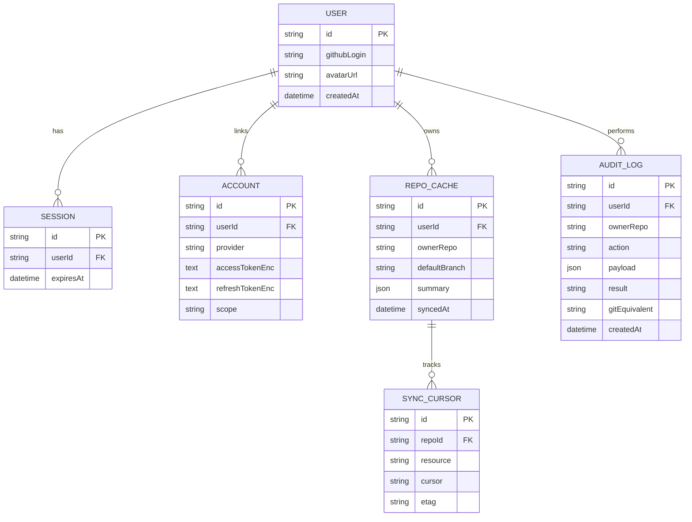

# 技术分析

| 项 | 内容 |
| --- | --- |
| 文档版本 | v0.1 |
| 状态 | 初稿（M0，待评审） |
| 更新日期 | 2026-10-03 |
| 关联文档 | [需求分析](requirements.md) · [实现路线](roadmap.md) · [待办日志](todo.md) |

---

## 1. 技术目标与约束

### 1.1 目标

- 支撑「登录 → 选仓库 → 时间线 → 点击操作」的完整闭环；
- 在**中等规模仓库**（1k–10k commits、≤50 分支）下保持流畅；
- 写操作安全、可解释、可追溯；
- 单人可维护：技术栈收敛、少运维（Serverless 优先）。

### 1.2 约束

- GitHub 是唯一数据源（不复制代码内容，只缓存元数据）；
- OAuth App 的 `client_secret` 不能出现在浏览器端，**必须有服务端**；
- GitHub REST API 速率：认证用户 5000 req/h；未认证 60 req/h（决定了必须缓存与聚合请求）；
- 项目初期无预算 → 优先免费额度（Vercel Hobby、Neon/Supabase 免费层）。

## 2. 关键技术问题清单

| # | 问题 | 结论（初版） |
| --- | --- | --- |
| Q1 | 鉴权如何做才安全？ | 服务端 OAuth（Auth.js）+ HttpOnly 会话 Cookie，令牌加密落库 |
| Q2 | 读数据用 REST 还是 GraphQL？ | 以 **GraphQL v4** 为主（一次请求聚合提交/分支/PR/Issue），写操作走 REST |
| Q3 | 如何扛住限流与深分页？ | 服务端缓存（ETag/条件请求）+ 增量同步 cursor + 分页窗口 |
| Q4 | 提交 DAG 的泳道布局怎么算？ | 服务端预计算 lane 分配，前端只负责渲染（算法见 §7） |
| Q5 | 大仓库前端如何不卡？ | 虚拟滚动 + Canvas/SVG 混合渲染 + 分层加载（先结构后细节） |
| Q6 | 写操作如何避免误操作？ | 预览 + 确认 + 幂等键 + 审计日志 + 24h 恢复窗口 |
| Q7 | 如何感知仓库更新？ | MVP 用「打开时拉取 + 短 TTL 缓存」；后续引入 Webhook / 定时增量同步 |

## 3. 架构方案选型

### 3.1 候选方案

| 维度 | A. Next.js 全栈单仓（推荐） | B. Vite SPA + 独立 API | C. 纯前端 + PAT/Device Flow |
| --- | --- | --- | --- |
| 服务端 | Next.js Route Handlers / Server Actions | NestJS / Fastify | 无 |
| 部署 | 单次部署（Vercel） | 两处部署（前后端分离） | 静态托管 |
| 安全性 | OAuth secret 在服务端 ✅ | ✅ | ❌ 令牌易泄露，无法安全保存 client_secret |
| 开发效率 | 类型端到端复用，快 ✅ | 边界清晰，但样板多 | 最快，但能力受限 |
| 可扩展性 | 中（Serverless 限制需规避） | 高 | 低 |
| 运维成本 | 低 ✅ | 中 | 低 |
| 适用判断 | **MVP 最优** | 团队规模变大后再演进 | 仅适合 Demo |

### 3.2 推荐架构（方案 A）


> 演进路径：当写操作编排变复杂（长事务、并发保护、重试队列）时，可把 `/api/ops` 拆为独立 Worker 服务（方案 B 的局部化），不影响前端。

## 4. 技术栈选型

| 领域 | 选择 | 备选 | 理由 |
| --- | --- | --- | --- |
| 语言 | TypeScript（strict） | — | 端到端类型复用，降低单人维护成本 |
| 框架 | Next.js（App Router） | Remix / SvelteKit | 一体化 SSR + API；生态与部署最省心 |
| 样式 | Tailwind CSS + shadcn/ui | MUI / Chakra | 原子化 + 可复制组件，避免被组件库绑死 |
| 可视化 | SVG（结构）+ Canvas（大数据量）+ D3 工具函数 | React Flow / ECharts | 时间线布局定制性强，需自研泳道；D3 只用其比例尺/路径工具 |
| 数据请求 | TanStack Query | SWR | 缓存、重试、失效策略完善 |
| 局部状态 | Zustand | Redux Toolkit | 仅存 UI 状态（选中节点、过滤器） |
| 表单校验 | React Hook Form + Zod | — | Zod 同时用于服务端参数校验 |
| 数据库 | PostgreSQL（Neon 或 Supabase） | SQLite / MongoDB | 关系清晰（用户-会话-缓存-审计）；Serverless 友好 |
| ORM | Prisma | Drizzle | 迁移与类型生成成熟 |
| 鉴权 | Auth.js（GitHub Provider） | 自研 OAuth | 内置 OAuth/PKCE/会话管理，可自定义 token 持久化 |
| 测试 | Vitest（单元）+ Testing Library（组件）+ Playwright（E2E） | Jest | 与 Vite/Next 生态契合 |
| CI/CD | GitHub Actions + Vercel | — | 免费、与仓库天然集成 |
| 代码质量 | ESLint + Prettier + commitlint + Changesets(可选) | — | 统一风格与提交规范 |

## 5. 数据模型（初稿）



设计要点：

- `accessTokenEnc` 使用服务端密钥加密（AES-256-GCM 或 libsodium sealed box），密钥来自环境变量/KMS；数据库中不出现明文。
- 提交与分支节点**默认不落库**（或只落泳道布局所需的精简字段），以 GitHub 为主数据源，避免合规负担与同步复杂度；缓存可随时失效重建。
- `AUDIT_LOG` 是删分支恢复的唯一依据，必须记录操作前后的关键 SHA。

## 6. GitHub 数据获取策略

### 6.1 读：GraphQL 聚合

一次请求获取时间线所需的核心数据（提交 + 分支头部 + 关联 PR），显著降低请求数：

```graphql
query Timeline($owner: String!, $name: String!, $branch: String!, $cursor: String) {
  repository(owner: $owner, name: $name) {
    defaultBranchRef { name }
    refs(refPrefix: "refs/heads/", first: 50) {
      nodes { name target { oid ... on Commit { committedDate } } }
    }
    object(expression: $branch) {
      ... on Commit {
        history(first: 50, after: $cursor) {
          pageInfo { hasNextPage endCursor }
          nodes {
            oid
            messageHeadline
            committedDate
            author { user { login avatarUrl } name }
            parents(first: 2) { nodes { oid } }
            associatedPullRequests(first: 3) { nodes { number title state mergedAt } }
          }
        }
      }
    }
  }
  rateLimit { limit cost remaining resetAt }
}
```

### 6.2 缓存与限流

| 策略 | 说明 |
| --- | --- |
| 短 TTL 缓存 | 仓库列表 5 min；时间线首页 2 min；节点详情 30 min |
| 条件请求 | REST 用 `If-None-Match`（ETag）；GraphQL 用查询哈希 + 结果缓存 |
| 分页窗口 | 时间线按「页」维护 cursor，向前滚动时增量拉取，不重复请求 |
| 增量同步 | 记录各资源 cursor/时间戳，仅拉取新增提交与事件 |
| 限流防护 | 读取 `rateLimit` 字段，低于阈值时降级为「仅缓存展示 + 提示恢复时间」 |
| 错误降级 | 部分数据失败时展示其余内容（局部失败优于整体白屏） |

### 6.3 写：REST API 操作映射

| 用户操作 | GitHub API | 关键参数 | 失败处理 |
| --- | --- | --- | --- |
| 创建分支 | `POST /repos/{o}/{r}/git/refs` | `ref=refs/heads/x`, `sha` | 已存在/无权限 → 明确提示 |
| 删除分支 | `DELETE /repos/{o}/{r}/git/refs/heads/{b}` | 分支名 | 受保护(422)/已删除(404) → 幂等视为成功 |
| 创建 Issue | `POST /repos/{o}/{r}/issues` | `title`, `body`, `labels` | 校验失败 → 表单级错误回显 |
| 创建 PR | `POST /repos/{o}/{r}/pulls` | `head`, `base`, `title` | 无可合并提交 → 提示并建议 |
| 合并 PR | `PUT /repos/{o}/{r}/pulls/{n}/merge` | `merge_method` | 409 冲突 → 展示冲突文件与建议操作 |
| 恢复分支 | `POST /repos/{o}/{r}/git/refs` | 记录的 SHA | SHA 已被 GC → 提示无法恢复 |

### 6.4 写操作通用原则

1. **幂等键**：每个操作携带客户端生成的 `operationId`，服务端去重；
2. **前置校验**：分支保护、权限（`viewerPermission`）、冲突状态在执行前检查；
3. **先记录后执行**：审计日志先写「意图」，执行后补结果，确保崩溃可追溯；
4. **结果回执**：返回 GitHub 链接、实际生效的参数与等价 Git 命令。

## 7. 提交图（DAG）泳道布局算法

输入：按拓扑序（`git log --topo-order` 等价顺序）排列的提交数组，每个提交含 `oid`、`parents[]`、引用的分支。

输出：每个提交的 `lane`（列号）、`color`、连线段（`edges`），可直接渲染为 SVG。

```text
算法：Lane Assignment（贪心，单遍）

lanes = []            # 每个 lane 当前「预期下一个提交」的 oid
commits = topo_order(all_commits)

for c in commits:
    # 1) 定位：找已等待该提交的 lane
    lane = lanes.index_of(c.oid)
    if lane == -1:
        lane = first_free_lane(lanes)      # 新分支或新根

    # 2) 分配并渲染节点
    c.lane = lane

    # 3) 占位：第一个父提交继承当前 lane，其余父提交开新 lane（分叉）
    lanes[lane] = c.parents[0] if c.parents else None
    for p in c.parents[1:]:
        if p not in lanes:
            lanes.insert(lane + 1, p)      # 分叉向右展开
            # 记录分叉边：c -> p（跨 lane）

    # 4) 清理：合并后回收空 lane，保持图形紧凑
    compact(lanes)

分支着色：按分支名哈希取色；同一提交被多分支引用时取「最活跃分支」的颜色并标记多引用。
```

工程要点：

- 算法在**服务端**执行，结果随分页一起返回并缓存（`repo + branch + range` 为键）；
- 前端只做坐标映射（时间 → y，lane → x）与虚拟窗口裁剪；
- 边界情况需专门测试：merge commit（多父）、root commit（无父）、八爪鱼合并、rebase 后的孤儿提交、跨分页的分支连线。

## 8. 安全设计

| 领域 | 措施 |
| --- | --- |
| OAuth | Authorization Code + PKCE；`state` 防 CSRF；回调地址白名单 |
| 权限最小化 | 只读阶段仅需 `read:user` + `public_repo`（私有仓库需 `repo`，在 UI 中明确说明）；写操作按需提示 |
| 令牌存储 | 服务端加密（AES-256-GCM），密钥独立于数据库；令牌不写日志、不回传前端 |
| 会话 | HttpOnly + Secure + SameSite=Lax Cookie；滑动过期 + 绝对过期 |
| 写操作防护 | 二次确认 + 默认分支/保护分支禁改 + 影响预览 + 操作频率限制 |
| 审计 | 记录「谁、何时、对哪个仓库、做了什么、结果如何、等价命令」 |
| 依赖安全 | Dependabot + `npm audit` 纳入 CI；锁文件提交 |
| 隐私 | 只缓存元数据；用户可一键清除本地缓存与授权（撤销 token） |

## 9. 测试与可观测性策略

| 层次 | 范围 | 工具 |
| --- | --- | --- |
| 单元测试 | 泳道算法、权限判断、操作编排（幂等/重试）、Zod 校验 | Vitest |
| 组件测试 | 时间线渲染、确认卡片、错误与空状态 | Testing Library |
| 集成测试 | GitHub 客户端（MSW 模拟 GraphQL/REST）、缓存与降级逻辑 | Vitest + MSW |
| E2E | 登录（mock OAuth）→ 选仓库 → 看时间线 → 建分支 → 删分支 → 恢复 | Playwright |
| 性能 | 1000/10000 节点时间线渲染基准 | Vitest bench + Playwright trace |
| 可观测性 | 结构化日志（请求耗时、限流剩余、操作结果）；错误上报（Sentry 可选） | — |

## 10. 技术风险与缓解

| 风险 | 可能性 | 影响 | 缓解 |
| --- | --- | --- | --- |
| GitHub GraphQL 复杂度/分页限制导致聚合查询超限 | 中 | 中 | 拆分为 2–3 个查询；按需加载关联数据 |
| 大仓库泳道布局计算慢 | 中 | 中 | Topo 排序后增量计算；缓存 + 分页窗口 |
| Serverless 冷启动与超时（写操作编排） | 中 | 低 | 操作拆小、异步轮询结果；必要时拆 Worker |
| OAuth 审核（私有仓库/组织授权）复杂 | 中 | 中 | MVP 优先公有仓库场景，文档说明 |
| 误删分支造成用户损失 | 低 | 高 | 禁止删除默认/保护分支；记录 SHA；24h 恢复入口 |
| 可视化复杂度失控（功能蔓延） | 高 | 中 | 严守「先看懂再操作」原则，里程碑评审把关 |

## 11. 待确认技术问题

1. 时间线是否需要在服务端缓存整棵 DAG（而非仅当前页）？影响大仓库首屏与内存占用。
2. 是否需要引入 Webhook 做准实时更新（需要用户配置，成本较高）？
3. 私有仓库是否进入 MVP？（涉及 OAuth scope 与用户信任成本）
4. 泳道算法是否需要在 Web Worker 中提供前端增量重算（离线过滤场景）？
