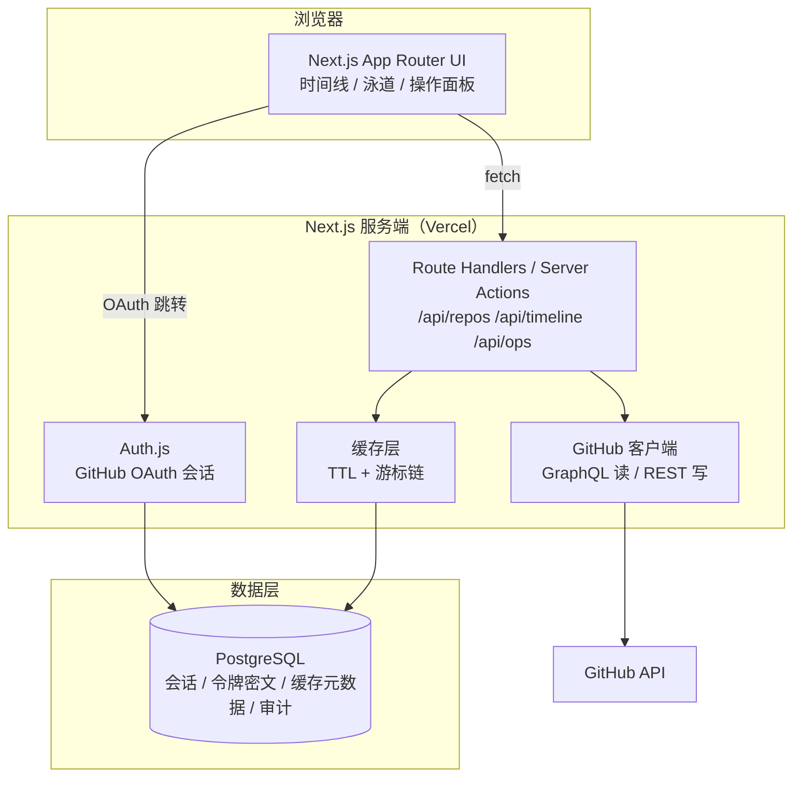
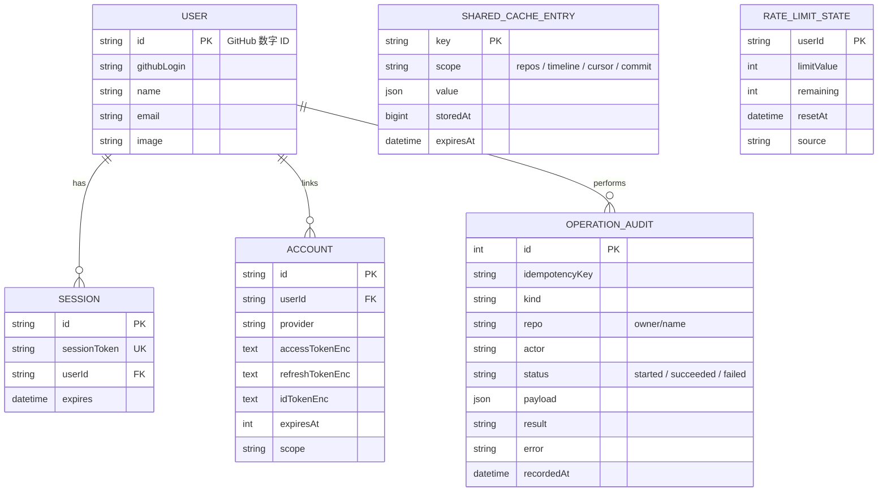

# 技术分析

| 项 | 内容 |
| --- | --- |
| 文档版本 | v0.2 |
| 状态 | 已定稿（与 M1–M3 的实现一致；实现期差异见 §4、§5 的说明） |
| 更新日期 | 2026-10-10 |
| 关联文档 | [需求分析](requirements.md) · [实现路线](roadmap.md) · [待办日志](todo.md) |

---

## 1. 技术目标与约束

### 1.1 目标

- 支撑「登录 → 选仓库 → 时间线 → 点击操作」的完整闭环；
- 在**中等规模仓库**（1k–10k commits、≤50 分支）下保持流畅；
- 写操作安全、可解释、可追溯；
- 单人可维护：技术栈收敛、少运维（Serverless 优先）。

### 1.2 约束

- GitHub 是唯一数据源（不复制代码内容，只缓存元数据）；
- OAuth App 的 `client_secret` 不能出现在浏览器端，**必须有服务端**；
- GitHub REST API 速率：认证用户 5000 req/h；未认证 60 req/h（决定了必须缓存与聚合请求）；
- 项目初期无预算 → 优先免费额度（Vercel Hobby、Neon/Supabase 免费层）。
- **私有仓库进入 MVP**：OAuth scope 使用 `repo`，需在授权说明与 UI 中明确用途；
- **零配置**：使用平台内置 OAuth App，不要求用户自建应用或填写 Client ID/Secret；
- **在线优先、不提供离线模式**：所有数据实时来自 GitHub，缓存只做性能优化。

### 1.3 已确认技术决策（2026-10-03）

| 编号 | 决策 | 技术影响 |
| --- | --- | --- |
| T1 | 时间线按提交聚合 | 数据模型与渲染以 commit 为原子节点；分支/PR/Issue 以标注、连线、面板形式挂载 |
| T2 | 私有仓库纳入 MVP | OAuth scope 为 `read:user` + `repo`；需处理组织 SSO 授权失败的引导 |
| T3 | 平台内置 OAuth App（零配置） | 服务端持有 Client ID/Secret；否决需要用户填 PAT 或走 Device Flow 的方案 |
| T4 | 不支持离线 | 不做 IndexedDB/Service Worker 离线缓存；断网展示明确错误与重试 |

## 2. 关键技术问题清单

| # | 问题 | 结论（初版） |
| --- | --- | --- |
| Q1 | 鉴权如何做才安全？ | 服务端 OAuth（Auth.js）+ HttpOnly 会话 Cookie，令牌加密落库 |
| Q2 | 读数据用 REST 还是 GraphQL？ | 以 **GraphQL v4** 为主（一次请求聚合提交/分支/PR/Issue），写操作走 REST |
| Q3 | 如何扛住限流与深分页？ | 服务端缓存（ETag/条件请求）+ 增量同步 cursor + 分页窗口 |
| Q4 | 提交 DAG 的泳道布局怎么算？ | 前端计算 lane 分配（`packages/git-graph`），服务端只提供分页提交（算法见 §7） |
| Q5 | 大仓库前端如何不卡？ | 虚拟滚动 + SVG 分层渲染 + 窗口切片 + 分层加载（先结构后细节） |
| Q6 | 写操作如何避免误操作？ | 预览 + 确认 + 幂等键 + 审计日志 + 24h 恢复窗口 |
| Q7 | 如何感知仓库更新？ | MVP 用「打开时拉取 + 短 TTL 缓存」；后续引入 Webhook / 定时增量同步 |

## 3. 架构方案选型

### 3.1 候选方案

| 维度 | A. Next.js 全栈单仓（推荐） | B. Vite SPA + 独立 API | C. 纯前端 + PAT/Device Flow |
| --- | --- | --- | --- |
| 服务端 | Next.js Route Handlers / Server Actions | NestJS / Fastify | 无 |
| 部署 | 单次部署（Vercel） | 两处部署（前后端分离） | 静态托管 |
| 安全性 | OAuth secret 在服务端 ✅ | ✅ | ❌ 令牌易泄露，无法安全保存 client_secret |
| 开发效率 | 类型端到端复用，快 ✅ | 边界清晰，但样板多 | 最快，但能力受限 |
| 可扩展性 | 中（Serverless 限制需规避） | 高 | 低 |
| 运维成本 | 低 ✅ | 中 | 低 |
| 适用判断 | **MVP 最优（选定）** | 团队规模变大后再演进 | 已否决：要求用户自备令牌，与「零配置」决策（T3）冲突 |

### 3.2 推荐架构（方案 A）



> 演进路径：当写操作编排变复杂（长事务、并发保护、重试队列）时，可把 `/api/ops` 拆为独立 Worker 服务（方案 B 的局部化），不影响前端。

## 4. 技术栈选型

| 领域 | 选择 | 备选 | 理由 |
| --- | --- | --- | --- |
| 语言 | TypeScript（strict） | — | 端到端类型复用，降低单人维护成本 |
| 框架 | Next.js（App Router） | Remix / SvelteKit | 一体化 SSR + API；生态与部署最省心 |
| 样式 | Tailwind CSS（自研组件，未引入组件库） | MUI / Chakra / shadcn/ui | 原子化 + 少量自研组件即可满足界面；避免为样式引入额外依赖 |
| 可视化 | SVG 分层渲染 + 虚拟窗口（`packages/git-graph` 负责布局与窗口切片） | Canvas / D3 / React Flow | 组件量受窗口约束，SVG 足够且便于无障碍与调试；未引入 Canvas / D3 |
| 数据请求 | 自研 fetch 封装（TTL 缓存 + 指数退避重试 + 降级） | TanStack Query / SWR | 数据源单一（服务端 GitHub API），自研封装更贴合「降级 + 游标链」需求 |
| 局部状态 | React 内置 state（未引入状态库） | Zustand / Redux Toolkit | 界面状态都在单页内，无需全局状态库 |
| 表单校验 | 自研轻量校验（`lib/*-ops.ts`） | React Hook Form + Zod | 表单字段少、规则集中在纯逻辑模块，便于单测与前后端复用 |
| 数据库 | PostgreSQL（Neon 或 Supabase） | SQLite / MongoDB | 关系清晰（用户-会话-缓存-审计）；Serverless 友好 |
| ORM | Prisma | Drizzle | 迁移与类型生成成熟 |
| 鉴权 | Auth.js（GitHub Provider） | 自研 OAuth | 内置 OAuth/PKCE/会话管理，可自定义 token 持久化 |
| 测试 | Vitest（单元）+ Playwright（E2E，mock 上游 + 落库会话） | Jest / Testing Library | 单测覆盖纯逻辑与数据层，组件行为交给 E2E；未引入组件测试库 |
| CI/CD | GitHub Actions + Vercel | — | 免费、与仓库天然集成 |
| 代码质量 | ESLint + Prettier + commitlint | — | 统一风格与提交规范；版本发布流程未启用 Changesets |

## 5. 数据模型



设计要点：

- `accessTokenEnc` / `refreshTokenEnc` / `idTokenEnc` 用服务端密钥加密（AES-256-GCM，`AUTH_TOKEN_ENC_KEY` 只存在于环境变量）；数据库中不出现明文令牌。
- 提交与分支节点**不落库**：以 GitHub 为主数据源，避免合规负担与同步复杂度；只缓存列表 / 时间线 / 游标链 / 提交详情四类元数据（`shared_cache_entries`，键按「类别 + 用户 + 仓库」拼接）。
- `rate_limit_states` 存每用户的 GitHub 配额快照（多实例 / Serverless 下判定一致），内存后端则只存在于进程内。
- `operation_audit` 是写操作审计与删分支恢复的唯一依据：同一次操作先写 `started`、执行后补终态，`payload` 里保留分支头 SHA 等恢复所需信息；`idempotencyKey` 由服务端按「操作人 + 类型 + 仓库 + 参数」派生，用于幂等回放。
- 与初稿相比，`REPO_CACHE` / `SYNC_CURSOR` 收敛为上面一张通用缓存表，`AUDIT_LOG` 收敛为 `operation_audit`（不再单列 `gitEquivalent`，等价命令由 `lib/git-commands.ts` 按 `kind + payload` 现算）。

## 6. GitHub 数据获取策略

### 6.1 读：GraphQL 聚合

一次请求获取时间线所需的核心数据（提交 + 分支头部 + 关联 PR），显著降低请求数：

```graphql
query Timeline($owner: String!, $name: String!, $branch: String!, $cursor: String) {
  repository(owner: $owner, name: $name) {
    defaultBranchRef { name }
    refs(refPrefix: "refs/heads/", first: 50) {
      nodes { name target { oid ... on Commit { committedDate } } }
    }
    object(expression: $branch) {
      ... on Commit {
        history(first: 50, after: $cursor) {
          pageInfo { hasNextPage endCursor }
          nodes {
            oid
            messageHeadline
            committedDate
            author { user { login avatarUrl } name }
            parents(first: 2) { nodes { oid } }
            associatedPullRequests(first: 3) { nodes { number title state mergedAt } }
          }
        }
      }
    }
  }
  rateLimit { limit cost remaining resetAt }
}
```

### 6.2 缓存与限流

| 策略 | 说明 |
| --- | --- |
| 短 TTL 缓存 | 仓库列表 5 min；时间线首页 2 min；节点详情 30 min |
| 陈旧兜底 | 限流或上游失败时优先回退到过期缓存，界面标注获取时间（stale），不冒充最新数据 |
| 分页窗口 | 时间线按「页」维护 cursor 链，向前滚动时增量拉取，不重复请求 |
| 增量同步 | cursor 链记录各资源位置，只拉取新增页；未引入 ETag 条件请求 |
| 限流防护 | 读取 `rateLimit` 字段，低于阈值时降级为「仅缓存展示 + 提示恢复时间」 |
| 错误降级 | 部分数据失败时展示其余内容（局部失败优于整体白屏） |
| 非离线 | 缓存仅存在于服务端且用于性能；**不作为离线数据源**，前端不承诺离线可用性 |

### 6.3 写：REST API 操作映射

| 用户操作 | GitHub API | 关键参数 | 失败处理 |
| --- | --- | --- | --- |
| 创建分支 | `POST /repos/{o}/{r}/git/refs` | `ref=refs/heads/x`, `sha` | 已存在/无权限 → 明确提示 |
| 删除分支 | `DELETE /repos/{o}/{r}/git/refs/heads/{b}` | 分支名 | 受保护(422)/已删除(404) → 幂等视为成功 |
| 创建 Issue | `POST /repos/{o}/{r}/issues` | `title`, `body`, `labels` | 校验失败 → 表单级错误回显 |
| 创建 PR | `POST /repos/{o}/{r}/pulls` | `head`, `base`, `title` | 无可合并提交 → 提示并建议 |
| 合并 PR | `PUT /repos/{o}/{r}/pulls/{n}/merge` | `merge_method` | 409 冲突 → 展示冲突文件与建议操作 |
| 恢复分支 | `POST /repos/{o}/{r}/git/refs` | 记录的 SHA | SHA 已被 GC → 提示无法恢复 |
| 撤销授权 | `DELETE /applications/{client_id}/token` | `client_id` + `client_secret`（Basic）、`access_token` | 204 视为已撤销；404 视为令牌已不存在（等价成功）；401 属应用配置问题 |

### 6.4 写操作通用原则（统一写管线）

所有写操作（建分支 / 建 Issue / 建 PR / 合并 / 删分支 / 恢复分支 / 撤销授权 / 清除数据）都走
`lib/operations.ts` 的同一条管线，差别只在各自的纯逻辑描述符与执行器：

1. **显式确认**：请求必须带 `confirmed: true`，界面侧先展示确认卡片与影响预览；
2. **幂等键**：服务端按「操作人 + 类型 + 仓库 + 参数」派生 `idempotencyKey`，命中窗口内的成功记录时直接回放结果；
   目的不是永久去重——账号级破坏性操作（撤销授权 / 清除数据）显式关闭回放，保证每次真正执行；
3. **先记录后执行**：审计先写 `started`，执行后补 `succeeded` / `failed`（含失败原因），崩溃可追溯；
4. **频率限制**：调用上游前先按「用户 + 滑动窗口」计数（默认 20 次 / 分钟，`WRITE_OPERATION_LIMIT` 可调），
   超限返回 429 + `Retry-After`（按窗口内最早一条记录的剩余时间）；
5. **失败语义**：上游错误统一分类为 401 / 403 / 404 / 422 / 429 / 网络不可达 / 超时，映射为可读文案；
   只有「请求没拿到响应」的网络失败会自动重试（服务端幂等兜底），4xx / 5xx 原样交给调用方；
6. **结果回执**：返回 GitHub 链接、实际生效的参数与等价 Git 命令；审计默认保留 90 天后按概率清理。

## 7. 提交图（DAG）泳道布局算法

输入：按拓扑序（`git log --topo-order` 等价顺序）排列的提交数组，每个提交含 `oid`、`parents[]`、引用的分支。

输出：每个提交的 `lane`（列号）、`color`、连线段（`edges`），可直接渲染为 SVG。

```text
算法：Lane Assignment（贪心，单遍）

lanes = []            # 每个 lane 当前「预期下一个提交」的 oid
commits = topo_order(all_commits)

for c in commits:
    # 1) 定位：找已等待该提交的 lane
    lane = lanes.index_of(c.oid)
    if lane == -1:
        lane = first_free_lane(lanes)      # 新分支或新根

    # 2) 分配并渲染节点
    c.lane = lane

    # 3) 占位：第一个父提交继承当前 lane，其余父提交开新 lane（分叉）
    lanes[lane] = c.parents[0] if c.parents else None
    for p in c.parents[1:]:
        if p not in lanes:
            lanes.insert(lane + 1, p)      # 分叉向右展开
            # 记录分叉边：c -> p（跨 lane）

    # 4) 清理：合并后回收空 lane，保持图形紧凑
    compact(lanes)

分支着色：按「泳道线的起点提交 oid」哈希取色（`pickBranchColor`），沿整条线继承；同一提交被多条线引用时沿用已有线的颜色。
```

工程要点：

- 算法在**前端**执行（`timeline-view`）：对已加载的提交跑一次 `computeLaneLayout`，再用 `sliceLaneLayout` 裁出虚拟窗口内的节点与连线，每帧 SVG 元素量不随总提交数增长；
- 服务端只提供分页提交数据（GraphQL `history`），不返回布局结果；前端另外负责坐标映射（时间 → y，lane → x）；
- 边界情况需专门测试：merge commit（多父）、root commit（无父）、八爪鱼合并、rebase 后的孤儿提交、跨分页的分支连线。

## 8. 安全设计

| 领域 | 措施 |
| --- | --- |
| OAuth | Authorization Code + PKCE；`state` 防 CSRF；回调地址白名单 |
| 权限范围 | `read:user` + `repo`（`repo` 用于访问用户有权访问的私有仓库与写操作）；授权页与 UI 明确说明用途，不申请任何用不到的权限 |
| 零配置凭据 | 平台内置 OAuth App：Client ID/Secret 仅存于服务端环境变量；用户无需自建应用、无需填写任何密钥 |
| 令牌存储 | 服务端加密（AES-256-GCM），密钥独立于数据库；令牌不写日志、不回传前端 |
| 会话 | HttpOnly + Secure + SameSite=Lax Cookie；滑动过期 + 绝对过期 |
| 写操作防护 | 二次确认 + 默认分支/保护分支禁改 + 影响预览 + 操作频率限制 |
| 审计 | 记录「谁、何时、对哪个仓库、做了什么、结果如何、等价命令」；保留 90 天后自动清理 |
| 自助撤销 / 数据清除 | 账号页可吊销 OAuth 授权枚举令牌，并一键删除本应用内的令牌密文、会话、审计与缓存记录 |
| 依赖安全 | Dependabot + `npm audit` 纳入 CI；锁文件提交 |
| 隐私 | 只缓存元数据、提交节点不落库；用户可自助撤销授权并清除本应用内全部个人数据 |

## 9. 测试与可观测性策略

| 层次 | 范围 | 工具 |
| --- | --- | --- |
| 单元 / 集成测试 | 泳道布局算法、数据层与 API 路由、缓存与降级、限频与幂等回放 | Vitest（内存后端 + 落库会话） |
| E2E | mock 上游 + 落库会话：看时间线 → 建/删/恢复分支 → 授权与账号操作 | Playwright（CI 起 postgres service） |
| 性能基准 | 大仓库时间线布局与渲染基准 | 独立脚本 `scripts/perf-validate.mjs` + `packages/git-graph` 的 perf 单测（M4 归口细化） |
| 可观测性 | 结构化错误文案 + 写操作审计（`operation_audit`）；未接入外部错误上报 | — |

## 10. 技术风险与缓解

| 风险 | 可能性 | 影响 | 缓解 |
| --- | --- | --- | --- |
| GitHub GraphQL 复杂度/分页限制导致聚合查询超限 | 中 | 中 | 拆分为 2–3 个查询；按需加载关联数据 |
| 大仓库泳道布局计算慢 | 中 | 中 | Topo 排序后增量计算；缓存 + 分页窗口 |
| Serverless 冷启动与超时（写操作编排） | 中 | 低 | 操作拆小、异步轮询结果；必要时拆 Worker |
| OAuth 审核（私有仓库/组织授权）复杂 | 中 | 中 | 授权页明示用途与范围；组织限制登录场景提供 `/permissions` 自助引导 |
| 误删分支造成用户损失 | 低 | 高 | 禁止删除默认/保护分支；记录 SHA；24h 恢复入口 |
| 可视化复杂度失控（功能蔓延） | 高 | 中 | 严守「先看懂再操作」原则，里程碑评审把关 |

## 11. 待确认技术问题

**已确认（2026-10-03）**

- ✅ 私有仓库进入 MVP → scope 采用 `repo`，见 §1.3 T2 与 §8；
- ✅ 不支持离线 → 取消 IndexedDB / Service Worker 离线方案，见 §1.3 T4；
- ✅ 时间线按提交聚合 → 节点模型以 commit 为准，见 §1.3 T1。

**实现期已落地（2026-10-10）**

- ✅ 服务端不缓存整棵 DAG：只缓存列表 / 时间线 / 游标链 / 提交详情四类元数据，见 §5 与 §6.2；
- ✅ 未引入 Webhook：保持「零配置」，时间线以短 TTL 缓存 + 手动刷新为准；
- ✅ 组织 SSO 授权失败：提供公开页 `/permissions` 自助引导，见 §10；
- ✅ 大仓库只做窗口切片：泳道布局对已加载提交整体计算后再按窗口切片，不做全量预生成，见 §7。

**仍开放**

1. 是否引入 Webhook 做准实时更新（需用户侧配置，与「零配置」原则存在张力，见 `docs/todo.md` BLOCK-03）。
